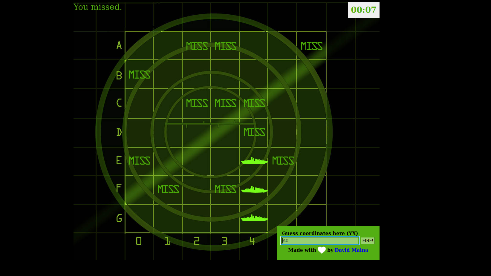

## JS Battleship Game

This is a simple Battleship game implemented in HTML5, CSS, and JavaScript. The game allows player to hit the ships by guessing their locations on the map. Ships are randomly placed on the map grid on game lunch.

_The game in action, with ships placed and gameplay in progress._

## Features

- Responsive design, compatible with different screen sizes
- Animated ship placement and gameplay
- Interactive map grid for ship placement and guessing
- Real-time feedback on hits and misses
- Time limit and real-time update of remaining time.

## Installation

1. Clone the repository: `git clone https://github.com/davymaish/battleship-game.git`
2. Open the `index.html` file in your preferred web browser.

## How to Play

1. Open the game in your web browser.
2. You have 60 seconds to sink at least two battleship!
3. Each battleship takes 3 grid boxes.
4. You must hit a ship thrice to sink it (hit all 3 grids boxes)
5. Guess ship coordinates in (YX) format.

## Contributing

Contributions are welcome! If you find any issues or have ideas for improvements, please open an issue or submit a pull request.

## License

This project is licensed under the [MIT License](LICENSE).

## Contact

For any inquiries or feedback, feel free to contact me via:

- Website: [davymaish.github.io](https://davymaish.github.io)
- Email: [davymaish6@gmail.com](mailto:davymaish6@gmail.com)
